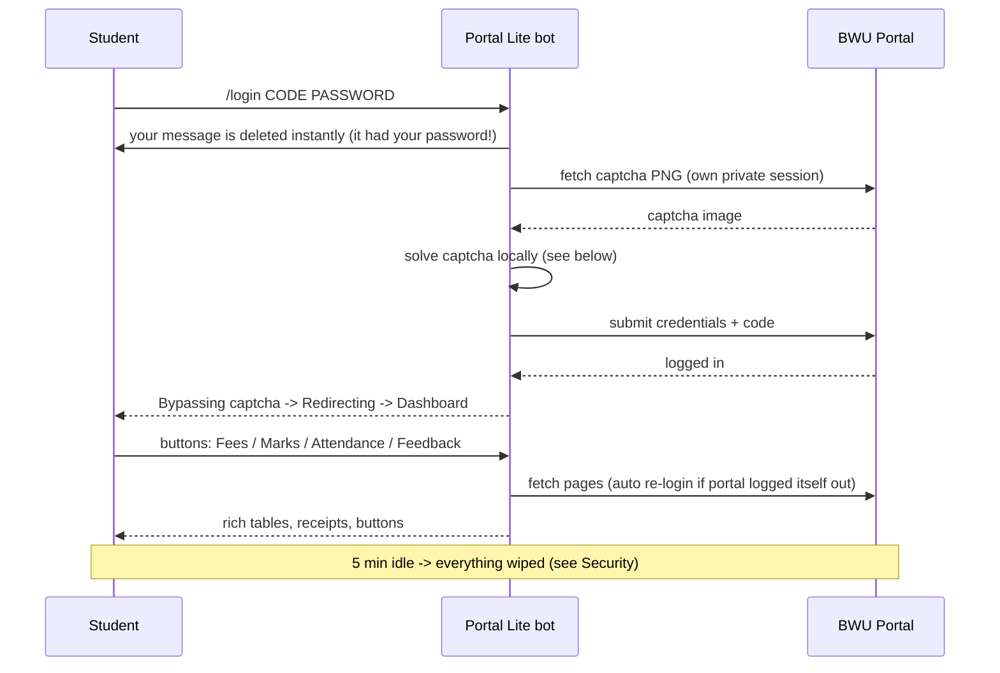
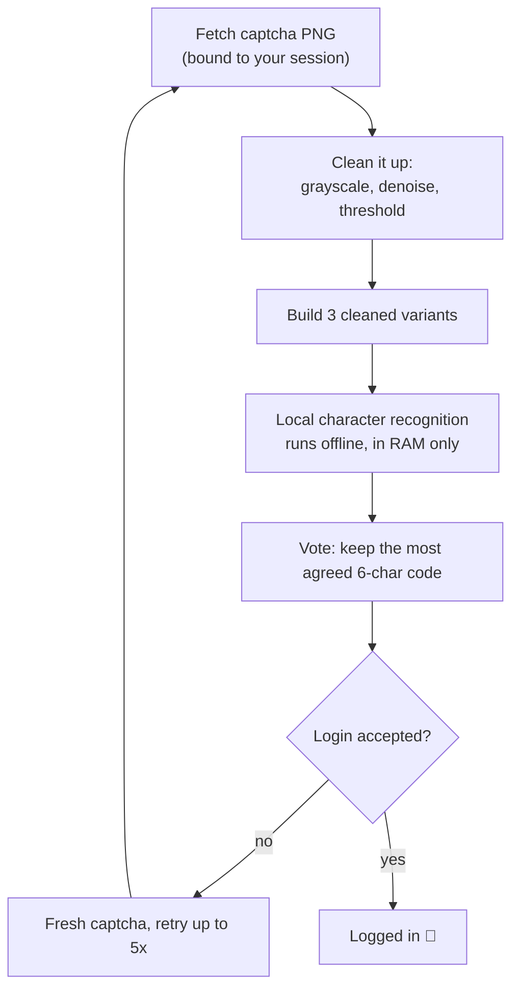
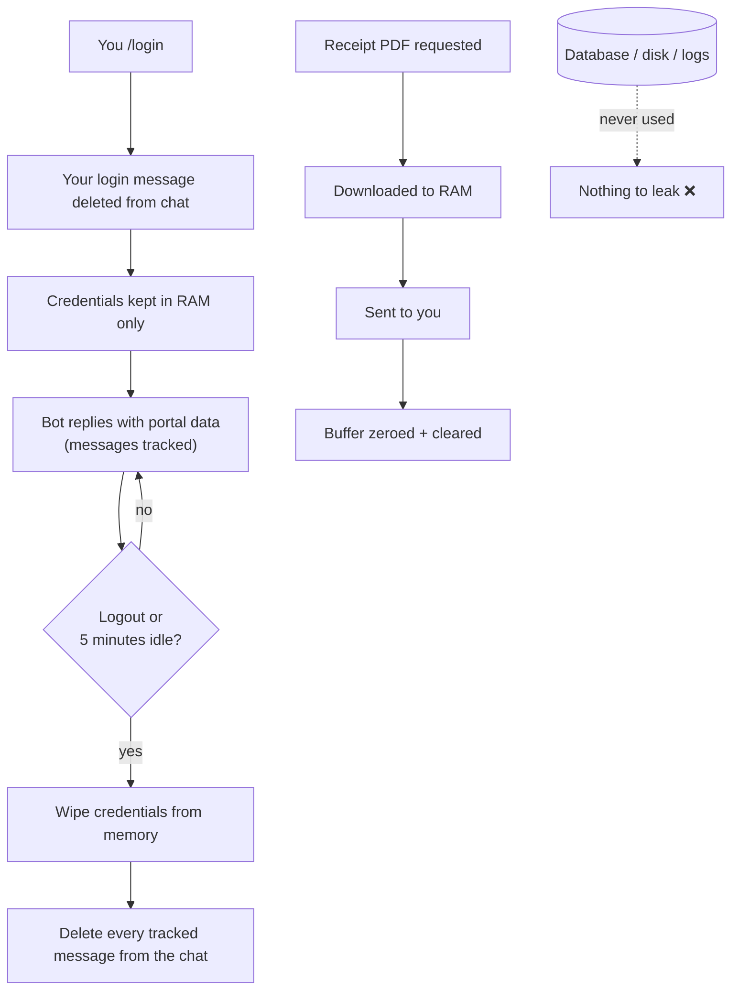

# Brainware Portal Lite

A Telegram bot for the **Brainware University Student Self-Service** portal — attendance, fees,
marks and notices in chat, with rich messages and instant button navigation.

> **Bot:** [@BWU_PRTL_BOT](https://t.me/BWU_PRTL_BOT)
>
> 🚧 **More features coming soon!**

## Features
- 🔐 **Multi-user** — every student logs in with their own portal credentials
- 🧩 **Captcha bypassed automatically** — just run `/login`, nothing to solve by hand
- 📊 **Dashboard** — attendance %, upcoming fee, activities, exam status + full course-wise table
- 💳 **Fees & Payments** — every fee head with amount, due date, paid date, receipt no and
  `Fully Paid` / `Due` status, plus outstanding totals per due date, and one-tap **receipt PDF
  download** (delivered straight to chat — never stored on the server)
- 🧾 **Student Feedback** — pick a course/topic, answer the questionnaire with buttons, submit;
  switch to another course afterwards (already-submitted topics are detected)
- 📝 **Marks Record** — pick a semester with buttons; all assessments (CT1/CT2, assignments,
  presentation, …) with full marks, marks obtained and totals
- 🎓 **Attendance** — every subject with attended/total, percentage and low-attendance flags
- 📢 **Notices** — latest announcements as clickable links
- ✨ **Rich Telegram messages** — real tables, expandable sections, banner slideshow, buttons
  inside the message, custom Premium emoji
- ⏳ **Live progress** — `🚀 Start login… → 🧩 Solving captcha… → 📊 Loading dashboard… → 🏠 Main dashboard`
- 🚨 **Alerts** — attendance below threshold, fees due soon; optional daily digest
- ⚙️ **Admin panel** — live stats, broadcast to users, clear sessions

## Commands
| Command | What it does |
|---|---|
| `/login STUDENT_CODE:PASSWORD` | Log in (also `/login STUDENT_CODE PASSWORD`). Student code is forced **UPPERCASE** |
| `/logout` | Log out of the portal |

Everything else — Dashboard, Fees, Marks, Attendance, Notices, Logout — is **buttons**:
both the keyboard above the message box and the buttons inside messages.

## How it works

### 🤖 The bot flow

### 🧩 How the captcha is bypassed

### 🔒 Security: why there is nothing to leak

## Honest notes — privacy & data
- **No database. No candidate/student data is saved anywhere** — not to disk, not to any DB.
- Your `/login` message (it contains your password) is **deleted from the chat instantly**, and
  bot messages showing portal data are **auto-deleted when the session expires** or on `/logout`.
- Your portal credentials are held **in memory only** while you are logged in. They are dropped
  the moment you `/logout` or the bot restarts.
- Each login is bound to your Telegram account only. **Everything is dropped from memory after
  5 idle minutes** — credentials and session alike — or instantly on `/logout`, so nothing can
  accumulate in RAM. Just `/login` again to continue.
- The portal logs you out itself after some inactivity (no fixed time). Whenever that happens
  the bot **re-logs-in silently** (captcha included) — your flow just continues.
- Receipt PDFs are delivered from RAM and **zeroed immediately after sending** — never written
  to the server disk.
- The captcha is bypassed automatically on each login — nothing is stored from it.
- No analytics, no trackers, no third-party sharing.
- Use the bot only with **your own** student account.

## 🚧 More features coming soon
Planned next: results/grade cards, exam form reminders, fee due push alerts, and more quality-of-life
updates. Suggestions are welcome via the bot.

## License
**Proprietary — All Rights Reserved.** See [LICENSE](LICENSE).

Viewing and forking for personal reference is allowed. Using, running, modifying,
redistributing, or operating this software as a service requires prior written
permission ([@BWU_PRTL_BOT](https://t.me/BWU_PRTL_BOT)).

## Disclaimer
Unofficial helper bot for personal use. Not affiliated with or endorsed by Brainware University.
